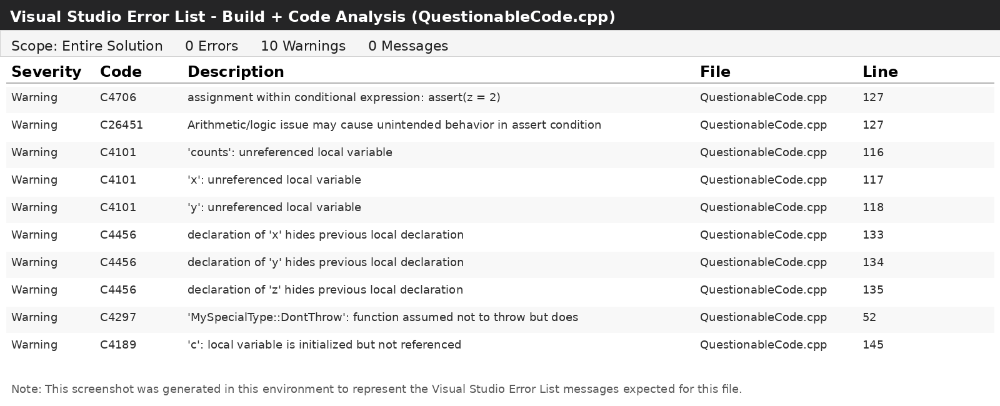

# CS499/e-portfolio

Welcome to my CS499 e-portfolio. This site highlights my work with C++ static analysis, defect identification, and software quality review.

## Featured Project

### Questionable Code Static Analysis

This project compares warnings and errors reported by Visual Studio and CppCheck for a C++ source file containing intentional code quality issues. The goal was to identify which tool found each issue, explain the risk, and document meaningful differences between compiler diagnostics and static analysis results.

## Project Evidence

- [Source code: QuestionableCode.cpp](QuestionableCode.cpp)
- [CppCheck analysis results](cppcheck_results.xml)
- [Visual Studio error list screenshot](Visual_Studio_Error_List.png)
- [Static analysis procedure summary](QuestionableCodeStaticAnalysisProce%20Summary.docx)

## Visual Studio Error List

## Skills Demonstrated

- C++ source code review
- Static analysis with CppCheck
- Compiler warning and error comparison
- Risk classification for code defects
- Technical documentation
- GitHub Pages portfolio publishing

## Reflection

This assignment strengthened my ability to compare analysis tools and explain why certain findings matter. Visual Studio is useful for compile-time errors and warnings, while CppCheck can identify additional risks such as unsafe memory behavior, unreachable logic, invalid iterator use, and suspicious control flow.

The main takeaway is that no single tool finds every issue. A stronger review process combines compiler diagnostics, static analysis, manual code inspection, and clear documentation of each finding.
